

  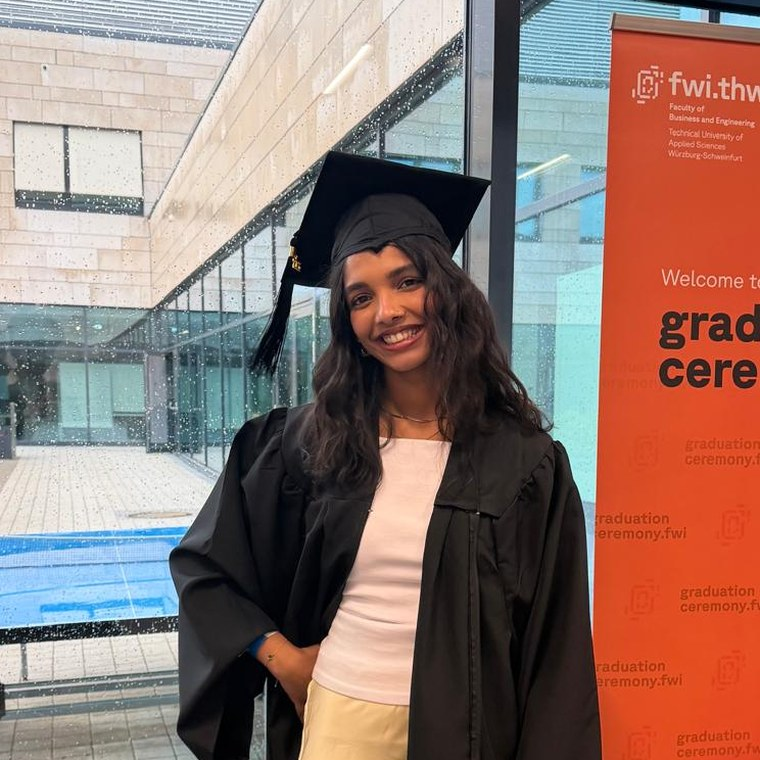
  <h1>Hi, I'm Sana!</h1>
  
Sana Fathima Srambicool

  
Originally from India, grew up in Dubai, now studying Business Intelligence &amp; Process Management at HWR Berlin.

  <a class="btn" href="PASTE-YOUR-LINKEDIN-LINK-HERE">LinkedIn</a>

<h2>About me</h2>

a little bit about how I got here

I grew up in Dubai and moved to Germany in 2021, when I was eighteen. I started with the Studienkolleg in Berlin and then studied Business and Engineering at THWS in Schweinfurt.

I chose that degree because I didn't want to pick between technical and business subjects, and it suited me. I'm usually the person explaining what the business side needs to the technical side, and the other way around.

In 2025 I started at Bosch in Stuttgart, first in sales and then writing my bachelor's thesis on redesigning a purchasing process. I stayed on as a Pre-Master to help put the new process in place. Bosch is where I worked with a lot of data, and where I realised I want to build up my technical skills.

Now I'm doing the BIPM master's at HWR Berlin. I'm using it to get stronger on the technical side, mainly SQL and Python, and I'd like to work as a Process Owner, Product Owner or Business Analyst.

<h2>My journey</h2>

every stop so far

until 2021<b>School, CBSE Class 12</b>Delhi Private School, Dubai

2021 – 2022<b>Studienkolleg</b>Berlin International College

2022 – 2026<b>B.Eng. Business and Engineering</b>THWS, Schweinfurt

2025<b>Intern, Sales Acquisition Management</b>Robert Bosch GmbH, Stuttgart

2025 – 2026<b>Bachelor's Thesis Student</b>Robert Bosch GmbH, Stuttgart

2026<b>Pre-Master, Business Digitization (Purchasing)</b>Robert Bosch GmbH, Stuttgart

since 2026<b>M.Sc. Business Intelligence &amp; Process Management</b>HWR Berlin

<iframe title="Map of my journey" src="journey_map.html"></iframe>

<h2>Places I've lived</h2>

four cities, one suitcase

<figure class="tile">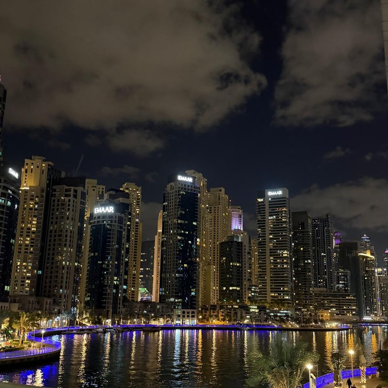<figcaption>Dubai</figcaption></figure>
<figure class="tile">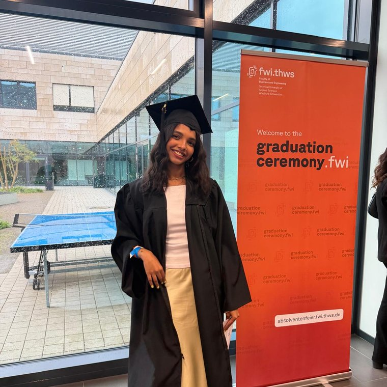<figcaption>Schweinfurt</figcaption></figure>
<figure class="tile">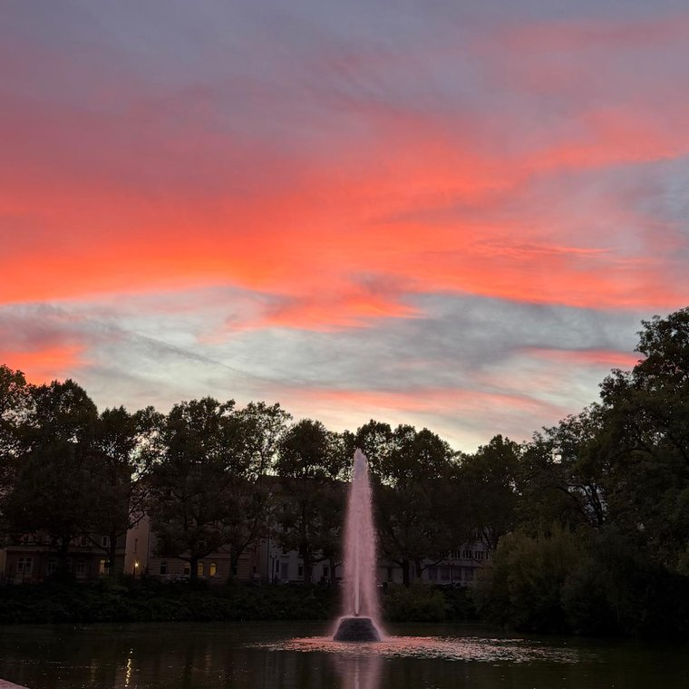<figcaption>Stuttgart</figcaption></figure>
<figure class="tile">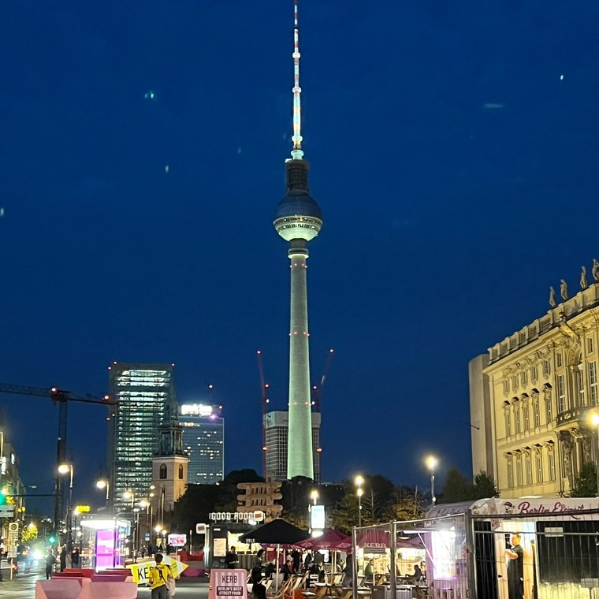<figcaption>Berlin</figcaption></figure>

<h2>Things I like</h2>

outside of uni

readingbakingtravellingfoodmatchaspringbeachessleeping

<figure class="tile"></figure>
<figure class="tile">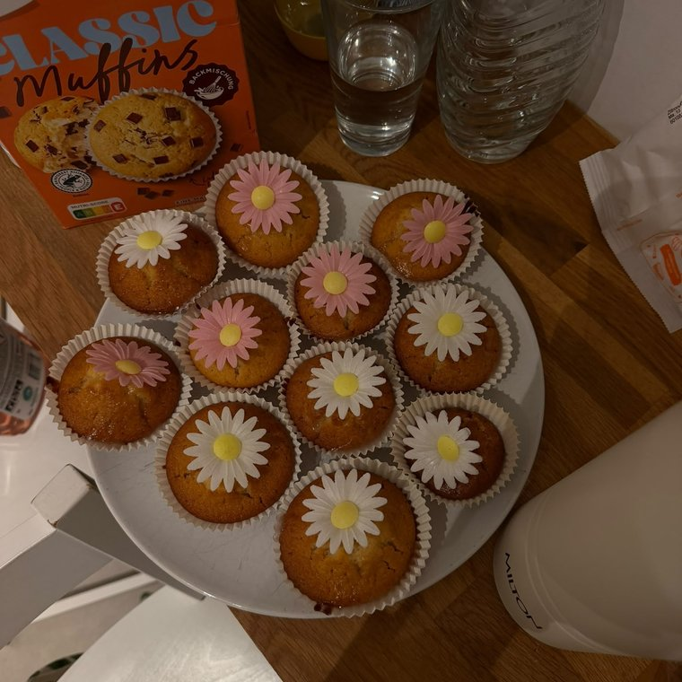</figure>
<figure class="tile">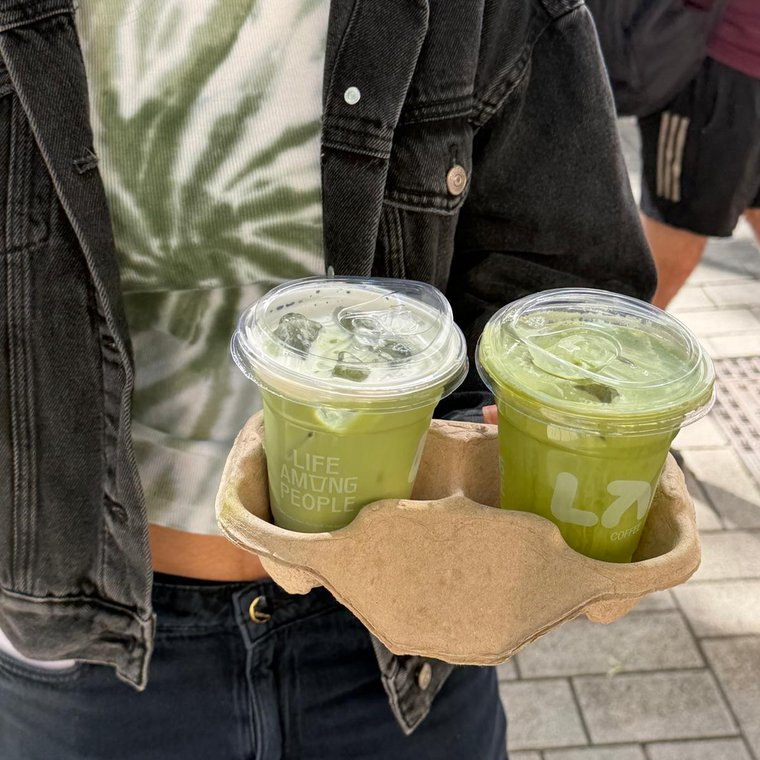</figure>
<figure class="tile">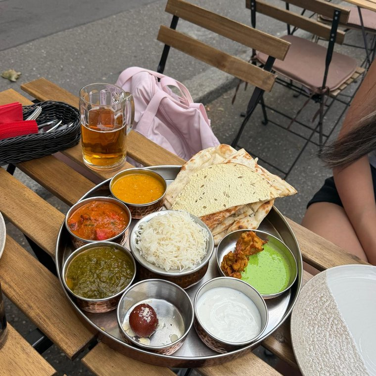</figure>
<figure class="tile">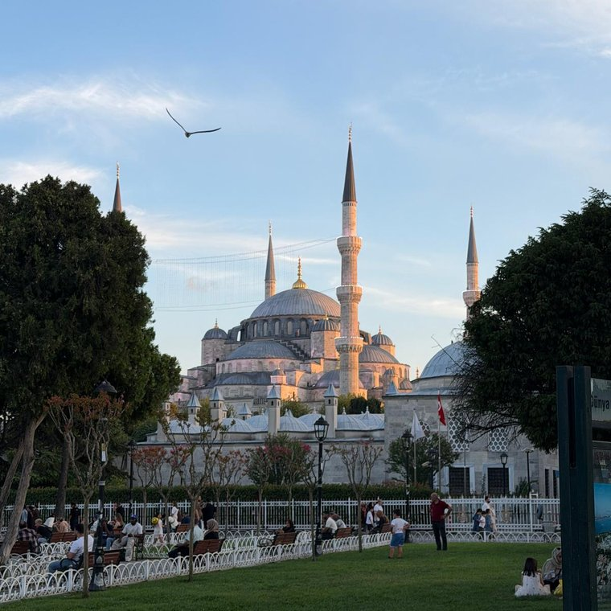</figure>
<figure class="tile">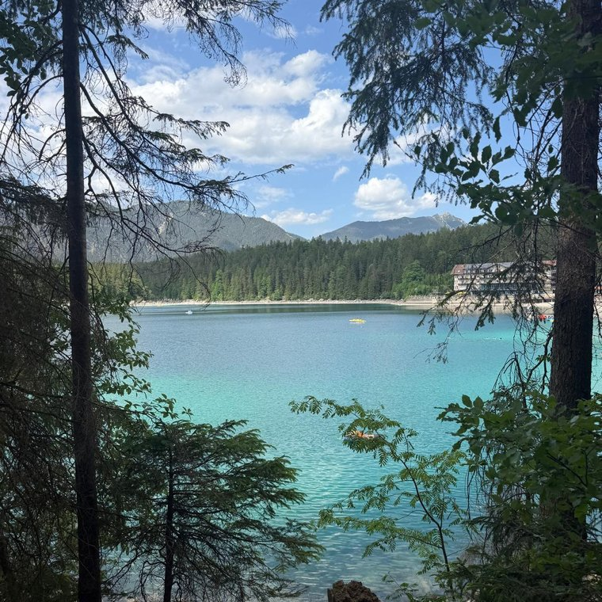</figure>
<figure class="tile">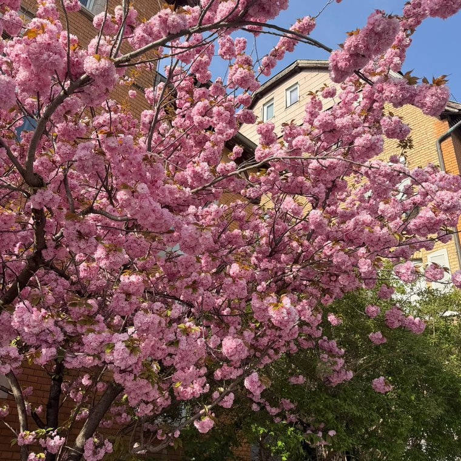</figure>
<figure class="tile">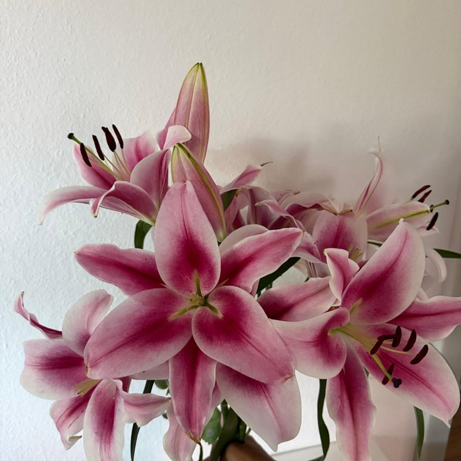</figure>
<figure class="tile">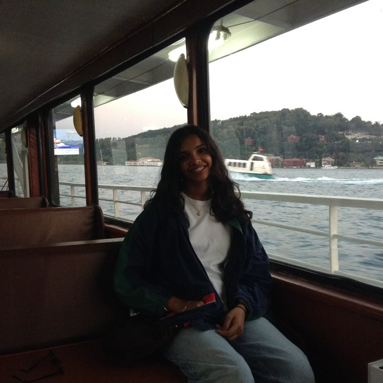</figure>
<figure class="tile">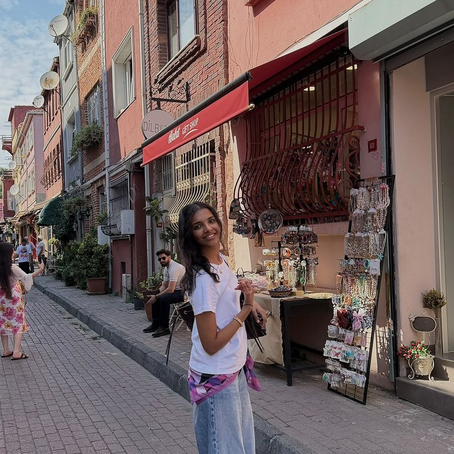</figure>

thanks for reading! &middot; Sana, BIPM 2026

